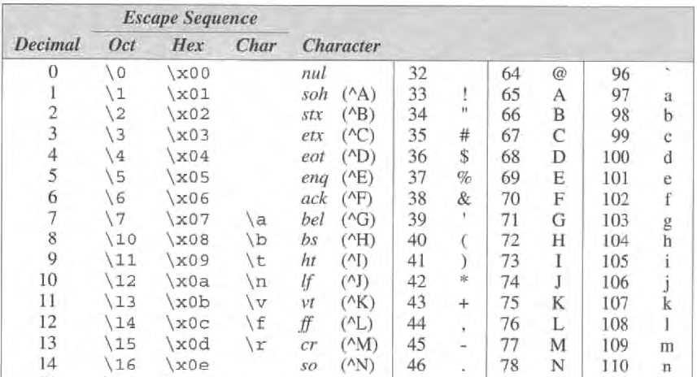

<!-- .slide: data-background="Cornsilk" -->


## Tipos básicos do C

### Diogo Silva
####  CAP / ENGEL
dasilva@academiafa.edu.pt
<!-- .slide: data-background="Cornsilk" -->

---

## Inteiros

--

Até agora usámos apenas o tipo `int` para representar números inteiros, mas existem outros:

```text
short int
unsigned short int

int
unsigned int

long int
unsigned lont int
```

--

Diferentes tipos podem representar números inteiros em diferentes intervalos e ocupam mais ou menos espaço em memória.

Estes intervalos e espaço ocupado em memória pode variar de máquina para máquina, mas é garantido que:

`short int < int < long int`

--

Processadores com arquitecturas de 64 bits começam a ser comuns e os intervalos de valores comuns são:


--

Uma forma rápida de verificar os limites de um determinado tipo numa máquina, é usar a biblioteca ``<limits.h>``.

```c
#include <limits.h>
#include <stdio.h>

int main(void) {
  int v;
  printf("max long=%ld\n", LONG_MAX);
}
```

Lista de todas as constantes na [documentação da biblioteca](https://man7.org/linux/man-pages/man0/limits.h.0p.html).

<small>https://man7.org/linux/man-pages/man0/limits.h.0p.html</small>


---

## Inteiros
### Constantes

Até agora definimos constantes de inteiros no formato decimal simples, i.e. usando 10 digitos distintos.

```c
#include <limits.h>
#include <stdio.h>

int main(void) {
  int v = 42;  // 42 é constante de inteiro
}
```

--


Mas existem outras formas.

É possível definir constantes em formato octal e hexadecimal.
Não iremos explorar estas bases, mas veremos como escrever constantes de inteiros diferentes.

--

```text
15L  -> interpretar 15 como um long int
15U  -> interpretar 15 como um unsigned int
15UL -> interpretar 15 como um unsigned long int
```

Também se pode escrever U e L em minúsculas. Pode-se escrever UL ou LU.

--

### Overflow

Como vimos anteriormente, os tipos inteiros têm um valor máximo e mínimo que podem representar.

```c
#include <limits.h>
#include <stdio.h>

int main(void) {
  int v = INT_MAX;
  printf("v=%d\n", v);
  printf("v=%d\n", v+1);
  return 0;
}
```

- `v = ?`
- `v + 1 = ?`

--

```c
#include <limits.h>
#include <stdio.h>

int main(void) {
  int v = INT_MAX;
  printf("v=%d\n", v);
  printf("v=%d\n", v+1);
  return 0;
}
```

- `v     = 2147483647`
- `v + 1 = -2147483648`

--

### printf e scanf

```text
scanf("%u", &v);  // unsigned int
printf("%u", v);   

scanf("%hd", &v);  // short int
printf("%hd", v);

scanf("%hu", &v);  // unsigned short int
printf("%hu", v);

scanf("%ld", &v);  // long int
printf("%ld", v);  

scanf("%lu", &v);  // unsigned long int
printf("%lu", v);
```


---

## Reais

```text
float
double
long double
```

--


O long double não aparece porque os intervalos variam bastante de máquina para máquina.

--

### constantes 

Diferentes formas de escrever o número 57:

```text
57.0
57.
57.0e0
57E0
5.7e1
5.7e+1
.57e2
570.e-1
```

--

### printf scanf

```text
double d;
scanf("lf", &d);
printf("lf", d);

long double ld;
scanf("%Lf", &ld);
printf("%Lf", ld);
```

---

## Texto

Até agora só usámos texto na escrita de frases "fixas" com o printf.

<!-- .element: class="fragment" data-fragment-index="1"-->

```c
printf("Preco = %f\n", &preco);
```
<!-- .element: class="fragment" data-fragment-index="1"-->

E se quisermos receber, manipular e escrever texto?
<!-- .element: class="fragment" data-fragment-index="2"-->

--

O C tem 1 tipo para trabalhar com texto - ``char``

```c
char letra = 'D';
```

As constantes de char definem-se entre plicas '' e contêm apenas um valor. Não confundir com aspas "".

--

Internamente os char são números que têm correspondência com letras, na tabela ASCII.




<small>ASCII = American Standard Code for Information Interchange</small>

--

Não é necessário saber esta tabela.

Facilmente, conseguimos obter o valor numérico de uma letra e vice-versa.


```c
char letra = 'A';
```
<!-- .element: class="fragment" data-fragment-index="1"-->

Como podemos saber o valor numérico de 'A'?
<!-- .element: class="fragment" data-fragment-index="1"-->

--

```c
char letra = 'A';
printf("letra %c = %d", letra, letra);

char letra = '\n';
printf("letra %c = %d", letra, letra);
```

A especificação de conversão para um char é %c.
<!-- .element: class="fragment" data-fragment-index="1"-->

--

Como um char é, internamente, um número inteiro, podemos realizar operações aritméticas.

```c
char letra = 'A';
printf("A letra depois de %c = %c", letra, letra+1);
```

O tamanho de um char é sempre 1 byte.
<!-- .element: class="fragment" data-fragment-index="1"-->

--

O char pode ser signed ou unsigned.

```c
char num1 = 127;
printf("num1=%d\n", num1);
num1 = 127 + 1;
printf("num1=%d\n", num1);


```

```text
num1=127
num1=-128
```

--

```c
unsigned char num2 = 255;
printf("num2=%d\n", num2);
num2 = 255 + 1;
printf("num2=%d\n", num2);
```

```text
num2=255
num2=0
```

Também estamos sujeitos a overflow!

--

Existem várias sequencias especiais, como podemos ver na tabela ASCII.


--


- Algumas podem ser especificadas com letras, como já vimos `\n \t`.
- Para outras é necessário usar o formato octal ou hexadecimal.

--

#### scanf, printf

```c []
char letra;
scanf("%c", &letra);
printf("letra recebida: %c\n", letra);
```

- Quando usamos o scanf, o enter fica no buffer.
- Se depois fossemos ler um número, o que não é número é ignorado.
- Mas se formos ler um char, irá haver correspondência entre %c e o \n inserido.

--

```c []
char letra, letra2;
scanf("%c", &letra);
printf("letra recebida: %c\n", letra);
scanf("%c", &letra2);
printf("letra2 recebida: %c\n", letra2);
```

- Aparentemente, o segundo comando do scanf foi ignorado.
- Na verdade, como já houve correspondência entre %c e um char do buffer, não foi necessário pedir input ao utilizador.

--

Qual será o valor da ``letra2``?

```c []
printf("Insira letra 1:");
scanf("%c", &letra);
printf("letra recebida: %c\n", letra);
printf("Insira letra 2:");
scanf("%c", &letra2);
printf("letra2 recebida: %d\n", letra2);
```

```text [4]
Insira letra 1:a
letra recebida: a
Insira letra 2:
letra2 recebida: 10
```

<!-- .element: class="fragment" data-fragment-index="1"-->

--

- Se formos à tabela ASCII, constatamos que 10 é o valor numérico para \n.


--

#### outras formas de leitura e escrita de char

getchar putchar

--

### exercicio - comprimento de mensagem

---

## Conversão de tipos

--

### conversões implicitas

--

### conversões explicitas

cast

---

## Definições de tipos - typedef

---

## ``sizeof``