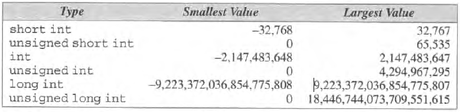
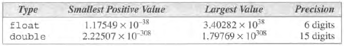

<!-- .slide: data-background="Cornsilk" -->


## Tipos básicos do C

### Diogo Silva
####  CAP / ENGEL
dasilva@academiafa.edu.pt
<!-- .slide: data-background="Cornsilk" -->

---

## Inteiros

--

Até agora usámos apenas o tipo `int` para representar números inteiros, mas existem outros:

```text
short int
unsigned short int

int
unsigned int

long int
unsigned lont int
```

--

Diferentes tipos podem representar números inteiros em diferentes intervalos e ocupam mais ou menos espaço em memória.

Estes intervalos e espaço ocupado em memória pode variar de máquina para máquina, mas é garantido que:

`short int < int < long int`

--

Processadores com arquitecturas de 64 bits começam a ser comuns e os intervalos de valores comuns são:



--

Uma forma rápida de verificar os limites de um determinado tipo numa máquina, é usar a biblioteca ``<limits.h>``.

```c
#include <limits.h>
#include <stdio.h>

int main(void) {
  int v;
  printf("max long=%ld\n", LONG_MAX);
}
```

Lista de todas as constantes na [documentação da biblioteca](https://man7.org/linux/man-pages/man0/limits.h.0p.html).

<small>https://man7.org/linux/man-pages/man0/limits.h.0p.html</small>


---

## Inteiros
### Constantes

Até agora definimos constantes de inteiros no formato decimal simples, i.e. usando 10 digitos distintos.

```c
#include <limits.h>
#include <stdio.h>

int main(void) {
  int v = 42;  // 42 é constante de inteiro
}
```

--


Mas existem outras formas.

É possível definir constantes em formato octal e hexadecimal.
Não iremos explorar estas bases, mas veremos como escrever constantes de inteiros diferentes.

--

```text
15L  -> interpretar 15 como um long int
15U  -> interpretar 15 como um unsigned int
15UL -> interpretar 15 como um unsigned long int
```

Também se pode escrever U e L em minúsculas. Pode-se escrever UL ou LU.

--

### Overflow

Como vimos anteriormente, os tipos inteiros têm um valor máximo e mínimo que podem representar.

```c
#include <limits.h>
#include <stdio.h>

int main(void) {
  int v = INT_MAX;
  printf("v=%d\n", v);
  printf("v=%d\n", v+1);
  return 0;
}
```

- `v = ?`
- `v + 1 = ?`

--

```c
#include <limits.h>
#include <stdio.h>

int main(void) {
  int v = INT_MAX;
  printf("v=%d\n", v);
  printf("v=%d\n", v+1);
  return 0;
}
```

- `v     = 2147483647`
- `v + 1 = -2147483648`

--

### printf e scanf

```text
scanf("%u", &v);  // unsigned int
printf("%u", v);   

scanf("%hd", &v);  // short int
printf("%hd", v);

scanf("%hu", &v);  // unsigned short int
printf("%hu", v);

scanf("%ld", &v);  // long int
printf("%ld", v);  

scanf("%lu", &v);  // unsigned long int
printf("%lu", v);
```


---

## Reais

```text
float
double
long double
```

--



O long double não aparece porque os intervalos variam bastante de máquina para máquina.

--

### constantes 

Diferentes formas de escrever o número 57:

```text
57.0
57.
57.0e0
57E0
5.7e1
5.7e+1
.57e2
570.e-1
```

--

### printf scanf

```text
double d;
scanf("lf", &d);
printf("lf", d);

long double ld;
scanf("%Lf", &ld);
printf("%Lf", ld);
```

---

## Texto

--

Tipo char

--

tabela ascii

--

operações em chars

--

signed/unsigned

--

caracteres especiais (escape sequences)

--

printf scanf

problema com espaço em branco e leitura do scanf seguinte


--

getchar putchar

--

### exercicio - comprimento de mensagem

---

## Conversão de tipos

--

### conversões implicitas

--

### conversões explicitas

cast

---

## Definições de tipos - typedef

---

## ``sizeof``